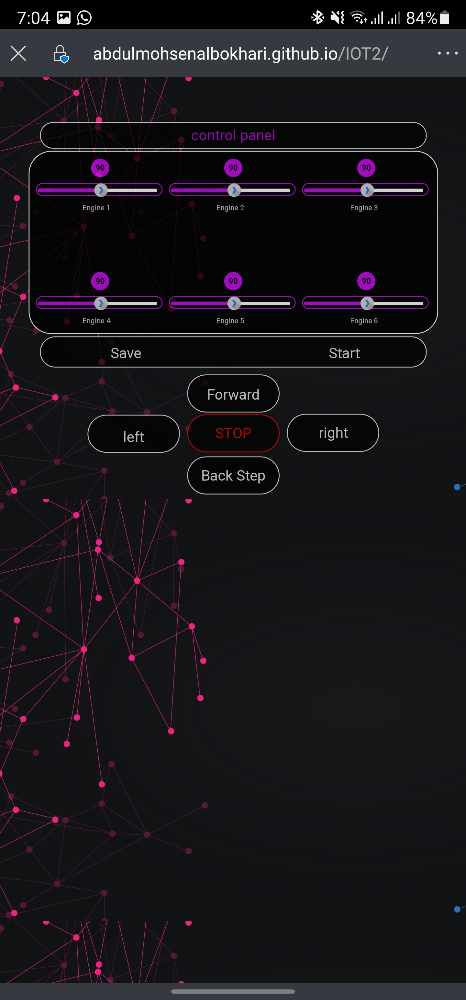

# IOT2
 control Robot

-- طريقة الإستخدام --

1- وضع القيم لكل محرك.

2- ثم الضغط على كلمة SAVE.

3- يتم ارسال القيم لقاعدة البيانات.

4- يتم تخزين القيم في قاعدة البيانات.

5- يتم ارسال القيم من قاعدة البيانات لصفحة الـ showValue.

6- وعند الضغط على زر START يتم تغيير الحالة من ( 0 الى 1) او ( 1 الى 0 ).

7- عند الضغط على اي رز ( Left,Right,Forward,Back,Stop ) يتم تخزين القيمة في قاعدة البيانات وعرضها في صفحة showDirection.

8- اخيرا يمكنك عرض الصفحة على اجهزة الجوال بشكل مناسب كم يتضح في الصورة

mobile web view

وايضا من خلال الرابط التالي ( https://abdulmohsenalbokhari.github.io/IOT2/ )

-- شرح محتويات الملفات --

1- index.php و index.html ( تحتوي على هيكل واجهة التحكم. )

2- style.css ( يحتوي على تصميم واجهة التحكم ويجعلها قابلة للإستخدام. )

3- script.js و Pluges.js ( يجعل الصفحة تفاعلية مع المستخدم. )

4- jquery-3.6.0.min.js ( استدعاك مكتبة JQUERY. )

5- server.php ( يتم الاتصال بقاعدة البيانات وتحديث قيم في قاعدة البيانات. )

6- showValue.php و showDirection.php ( يتم جلب القيم و والاتجاه من قاعدة البيانات. )

7- DataBasePictures (يحتوي على صور للموقع و قاعدة البيانات)